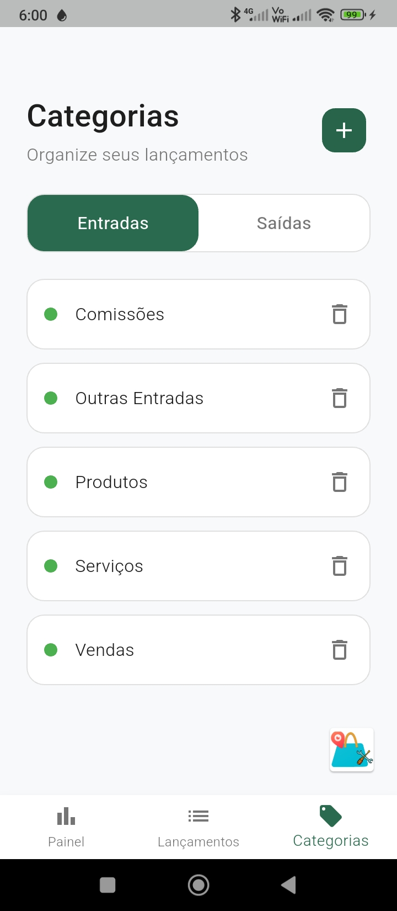
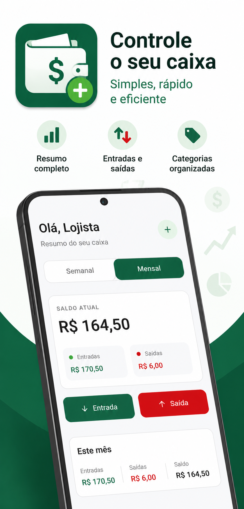
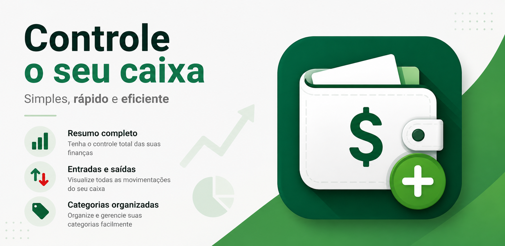
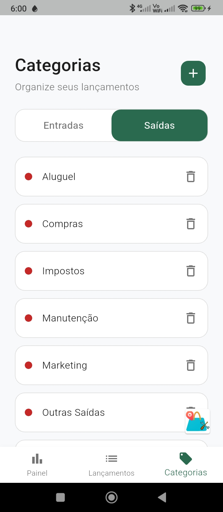
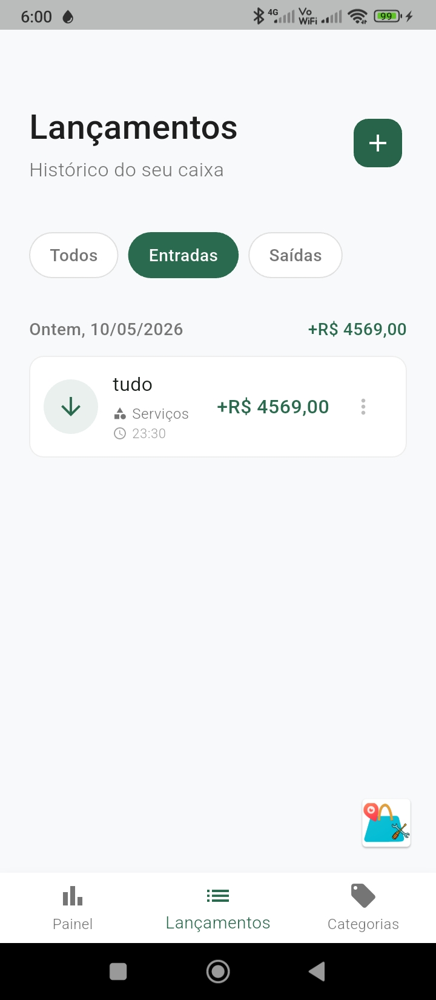
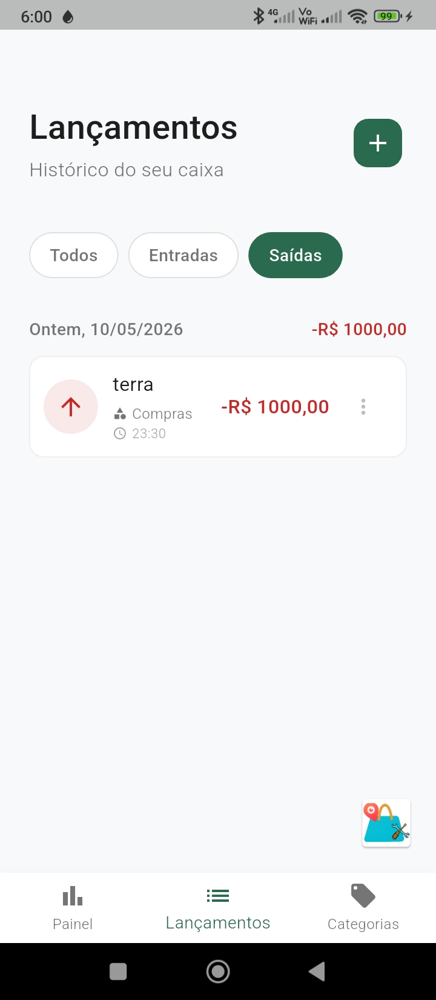
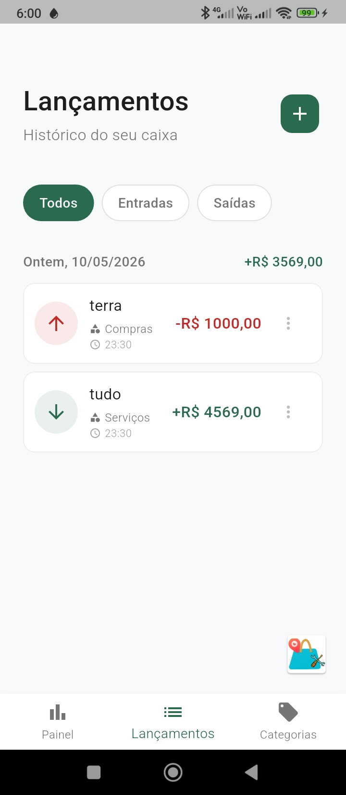
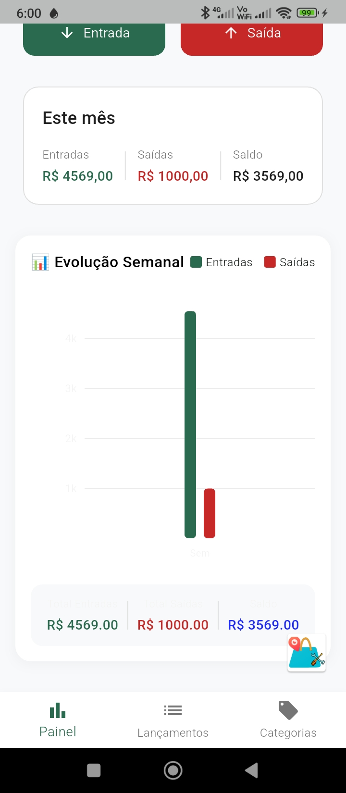
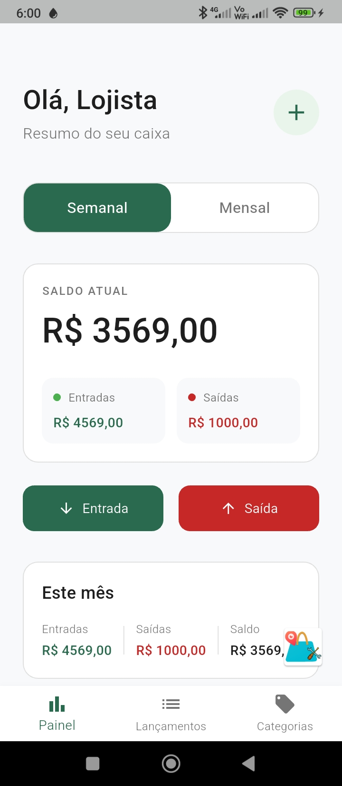
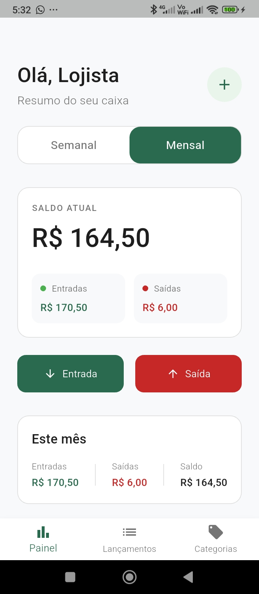

# Livro Caixa Flutter

Tenha um livro caixa na palma de sua mão. agora voce pode abandonar o livro caixa em papel por que como esse aplicativo voce tera controle diario de entradas e saídas , o pp é gratuito e pode ser baixado no google play

## Screenshots do App

|  |  |  |    |  |  |   |  |  |

